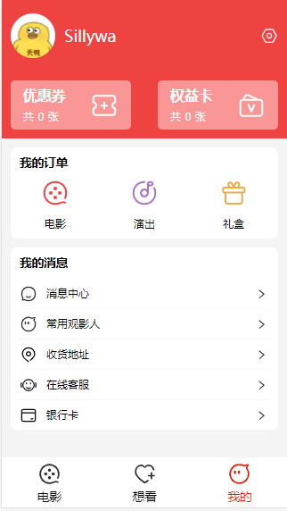

# 项目说明

项目的主要功能是对[豆瓣电影TOP250](https://movie.douban.com/top250)的信息作二次展示，属于个人学习 React 的练习项目。

在构建过程中，首先爬取了该网站上所有电影的必要信息，然后利用该信息来构建我们自己的APP。

后台是使用 `python + flask` 框架进行接口的开发

前端是使用 `React + Typescript` 构建的项目，在该项目中：

1. 使用 `redux` 进行状态管理
2. 使用 `react-router` 来进行路由管理
3. 使用 `styled-components` 的 CSS in JS 解决方案
4. 使用 `hooks` 对项目进行重构
5. 使用 `immutable` 对项目进行重构

## 项目进度

2021-05-18： 完成 TabBar 组件的封装，完成 MoviesList 组件，完成滑动到底部加载下一页数据

2021-05-19: 完成我的 和 想看页面

2021-05-20: 完成详情页面，加入 react-router

## 项目截图

## 项目构建

    create-react-app my-project --template typescript

## Getting Started with Create React App

This project was bootstrapped with [Create React App](https://github.com/facebook/create-react-app).

### Available Scripts

In the project directory, you can run:

#### `yarn start`

Runs the app in the development mode.\
Open [http://localhost:3000](http://localhost:3000) to view it in the browser.

The page will reload if you make edits.\
You will also see any lint errors in the console.

#### `yarn test`

Launches the test runner in the interactive watch mode.\
See the section about [running tests](https://facebook.github.io/create-react-app/docs/running-tests) for more information.

#### `yarn build`

Builds the app for production to the `build` folder.\
It correctly bundles React in production mode and optimizes the build for the best performance.

The build is minified and the filenames include the hashes.\
Your app is ready to be deployed!

See the section about [deployment](https://facebook.github.io/create-react-app/docs/deployment) for more information.

#### `yarn eject`

**Note: this is a one-way operation. Once you `eject`, you can’t go back!**

If you aren’t satisfied with the build tool and configuration choices, you can `eject` at any time. This command will remove the single build dependency from your project.

Instead, it will copy all the configuration files and the transitive dependencies (webpack, Babel, ESLint, etc) right into your project so you have full control over them. All of the commands except `eject` will still work, but they will point to the copied scripts so you can tweak them. At this point you’re on your own.

You don’t have to ever use `eject`. The curated feature set is suitable for small and middle deployments, and you shouldn’t feel obligated to use this feature. However we understand that this tool wouldn’t be useful if you couldn’t customize it when you are ready for it.

### Learn More

You can learn more in the [Create React App documentation](https://facebook.github.io/create-react-app/docs/getting-started).

To learn React, check out the [React documentation](https://reactjs.org/).